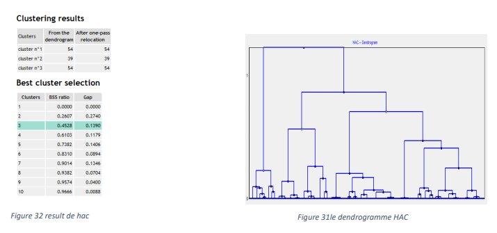
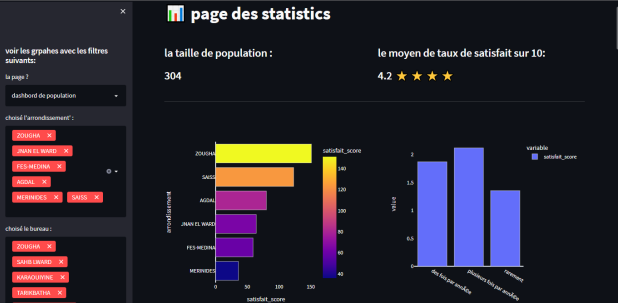
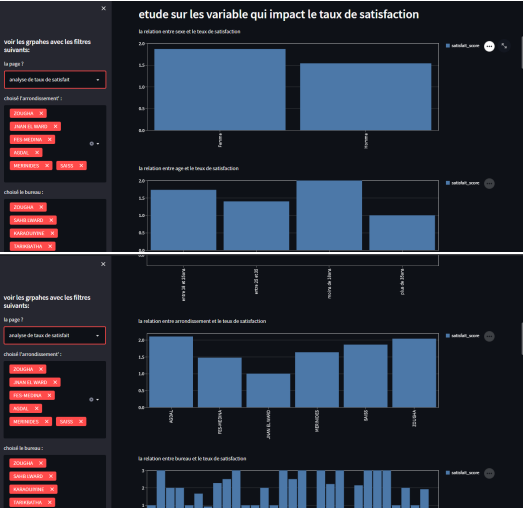
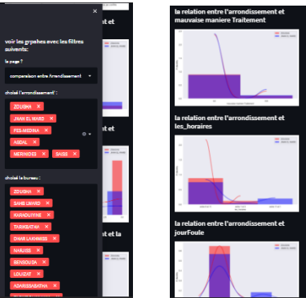

# Data Visualization and Processing Project
## Overview
This project involves the creation of a web application for data visualization and processing using Python, SPSS, Talend, Streamlit, Google Forms, and an API.
extrait de resultat d'analyse hac

###

###

###

###
## Files
app.py: the source code for the web application
data.csv: the coded data used in the project
sheet.json: the configuration file for accessing the Google Form questionnaire
untitled8.ipynb: the Jupyter notebook containing the data processing and analysis code
## Software and API
Anaconda: for running Jupyter notebooks (Spider distribution recommended)
Streamlit: for creating the web application. To install, run pip install streamlit. To run the application, use the command streamlit run app.py. More details can be found on GitHub.
SPSS: for statistical analysis
Talend: for ETL (extract, transform, load) operations on the data
Google Forms API: for retrieving responses from the questionnaire and integrating them into the analysis
## Description
This project aims to provide insights into the data collected through a Google Form questionnaire. The data is first extracted and transformed using Talend, and then analyzed using Python and SPSS. The results of the analysis are visualized using a web application built with Streamlit.
The web application allows users to explore different aspects of the data, such as trends and correlations, through various chart types and interactive features. The application also includes contextual information and explanations to help users understand the implications of the data.

 ## Conclusion
This project demonstrates the power of combining different tools and technologies for data visualization and processing. By using Python, SPSS, Talend, Streamlit, Google Forms, and an API, we were able to create a comprehensive and user-friendly application that allows users to explore and understand the data in meaningful ways. We hope that this application will be a valuable resource for our users and that it will help them to make informed and data-driven decisions. Thank you for visiting our project.
